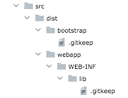

# shibboleth-plugin-parent
Parent gradle build to manage common functions for Unicon Shibboleth Plugin projects

## Creating a Shibboleth 4.1+ Plugin using this project
Using this project should simplify the effort needed to update external Shibboleth addon projects to a Plugin. One 
concern with multiple plugins has to do with managing the versions of dependency libraries that a plugin will load.
The Shibboleth plugin system will simply try to load the supplied jar dependencies. If multiple different
versions of a jar are present, there is no guarentee of the version that may get used.

In order to try and minimize conflicts, it is highly suggested to use the versions defined in this project's
properties - the steps to do so are explained below. Additionally, the needed bits for making a plugin are also
described below. Finally, by applying the build script in your project's gradle build, you should inherit all the 
build parts you need to create the plugin artifact.

### Including this parent build script and properties
Including this project's build script is a matter of two steps:

1) Insert the following _after_ your build's **dependency** section (in the main build script):

```
apply from: 'https://raw.githubusercontent.com/UniconLabs/shibboleth-plugin-parent/develop/build.gradle'
```

2) Add the following to your script's **plugins** section
``` 
    id 'groovy'
    id 'distribution'
    id 'signing'
```

In order to use the versions defined in the properties file you will need to add the following _before_ the
build file's **dependency** section (you may need to include this in any sub-build files that will use these
properties as well):

``` project.ext.config = new ConfigSlurper().parse(new URL("https://raw.githubusercontent.com/UniconLabs/shibboleth-plugin-parent/develop/config.groovy")) ```

References to this project's versions is done using references like:
```
$config.common.netty.version
```
Note that this is slightly different than how you would reference the normal project properties. These also 
will **not** override local values that may be configured in your project's gradle.properties file.
```
    compileOnly "org.opensaml:opensaml-storage-api:$config.common.opensaml.version"
    compileOnly "ch.qos.logback:logback-core:${project.'logback.version'}"
```

### Add the following properties to your gradle.properties file
* **plugin.package** - this should be the plugin package/location ( ie org/example/plugin/ ) and must end with a trailing slash

### Copy files from this project
Copy these two files from this project root to your project's root:
**iamtest.gpg, update.properties** 
#### update.properties file
You will need to modify the **update.properties** appropriately,
see: https://shibboleth.atlassian.net/wiki/spaces/IDP4/pages/1296760857/PluginDevelopment#Maintaining-the-Update-Property-File

#### You can skip the following if you have a production GPG signing file.
iamtest.gpg is a file that can be used to validate the build (it is the security file used to sign the artifacts).
This file is not intended for use to sign and distribute production ready artifacts and should be replaced by the
appropriate real GPG file.

Add the following to your project gradle.properties file:
```
    # These should be set in your global `gradle.properties` file - the values here are only for testing/validation of build
    signing.keyId=6675C13B
    signing.password=iamtestingkey
    signing.secretKeyRingFile=./iamtest.gpg
```

### Modify Gradle dependencies
In order to build the class you need to add for a plugin, you need to add the following to your
dependencies (because they are Shib jars, you should NOT include them in the deployment artifact:

```
    compileOnly "net.shibboleth.idp:idp-admin-api:$config.common.shibboleth.version"
    compileOnly "net.shibboleth.idp:idp-admin-impl:$config.common.shibboleth.version"
```

### Create the distribution folders
In your project **src** directory, create the directory structure: 

* **dist/bootstrap** 
* **dist/webapp/WEB-INF/lib**

In each (bottom) location, add an empty **.gitkeep** file - this will force git to accept and keep
the empty folder structure in the project. The result should look like:



### Create your project's plugin class and properties file
Somewhere in your project's source code, add a package for your plugin files. eg 
```
org.example.plugin
```
In this package, you need to add two files:
* The plugin class
* the **plugin.properties** file (the Shib wiki is confusing on the subject, but you need only
one plugin.properties file - this file needs to be in the jar in this location and will get copied during the build process)

see: https://shibboleth.atlassian.net/wiki/spaces/IDP4/pages/1296760857/PluginDevelopment#The-Service-definition
for full details on creating these files (they are both fairly trivial)

### Create your project net.shibboleth.idp.plugin.IdPPlugin file
In your **src/main/java/resources** directory, add the following directory: **META-INF/services/**

In that new location, create a file named: **net.shibboleth.idp.plugin.IdPPlugin**
The only thing to add to this file is the fully qualified class name of the plugin class. eg
```
org.example.plugin.ExamplePlugin 
```

### Final steps
That's it! You should now be able to do a standard **gradle clean build** and end up with 4 files
in your **build/distributions** directory. Things you will need to do:

#### Clean up dependencies
You can quickly check the new **dist/webapp/WEB-INF/lib** directory to see what JARs will be 
included. You may need to adjust your build to ensure that some jars are not included in the 
final output (changing from **implementation** to **compileOnly** or **testImplementation** etc)

If you are unsure where a JAR is coming from - check the dependency tree using
```
$> gradle -q dependencies
```
and check the list for the **runtimeClasspath** listing. You will need to check against the 
Shibboleth deployment actual JAR list to make sure there are not going to be any conflicting jar versions.

#### Sign and Deployment
TBD